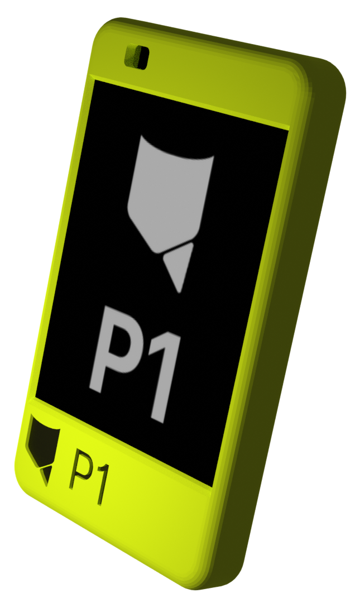
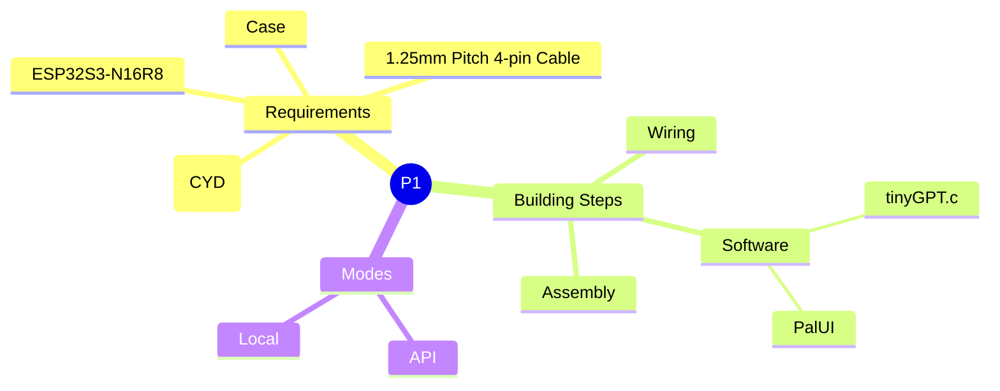


# P1

P1 is the world's first microcontroller-powered ***local*** AI device.

# Navigation

-   [Features](#features)
-   [Contents](#contents)
-   [Make your own P1](#make-your-own-p1)
-   [Future Plans](#future-plans)
-   [Contact](#contact)
-   [Support](#support)

# Features

**[PalUI](https://pocketive.tachion.tech/palui):** Not only a chat interface, but an app/program launcher for P1.

**API or Local:** Switch between popular API providers or Local mode quickly and easily, thanks to [tinyGPT.c](https://github.com/pocketive/tinygpt.c) architecture.

**Cheap & Simple:** P1 only needs 2 cheap and accessible microcontrollers to build, and its very simple to put it together!

**Completely Open Sourced:** From design and hardware to local AI architecture and PalUI, its %100 open-sourced.

-   **Notes**
    -   PalUI, GPT.c, tinyGPT.c and Pocketive P1 are developed for educational purposes only, therefore there might be weak points, like in design, codes and more. I don't claim that it's perfect, since project is under development and not finished. I developed all of them completely by myself, as a 14 years old student :)

-   **Why?**
	- Modern AI chatbots require sending your conversations to remote servers, raising privacy concerns about who has access to your data. Additionally, the massive computing infrastructure needed to run large language models has significant environmental costs. Pocketive P1 explores an alternative approach: running small language models directly on low-power microcontrollers. This enables private, offline AI inference without relying on cloud services or consuming substantial energy. While these models are currently limited compared to their larger counterparts, they demonstrate the potential for edge AI that keeps your data local and your conversations truly private.

# Contents

## Key files in this repository

### 3D design

- [p1.stl](3d/p1.stl) -> Basically, P1's current 3D design.

### Software

- [tinyGPT.c](https://github.com/pocketive/tinyGPT.c) -> Custom local AI architecture for microcontrollers, based on its original version [GPT.c](https://github.com/MYusufY/gpt.c) that i made.
- [PalUI](https://github.com/pocketive/palui) -> Currently a chat interface for microcontrollers, which i plan to turn into an agentic launcher for microcontrollers.

# Make your own P1

Here's the guide you need to follow to make your own P1 from scratch.

## Requirements

- ESP32S3-N16R8
- ESP32-2432S028 (CYD)
- 1.25mm Pitch 4-pin Cable
- [Case](/3d/p1.stl)

## Wiring

You need to connect ESP32S3, the "AI hub" and CYD to make local AI processing with [tinyGPT.c](https://github.com/pocketive/tinygpt.c) work.

Since they communicate over UART, its going to be very simple.

Here's a basic circuit:

The one at the right is the UART port at the CYD's bottom section, and the one on the left is ESP32S3.

> - GND -> GND
> - TX -> RX
> - RX -> TX

You can solder these 3 wires to ESP32S3 accordingly, and plug the port into CYD. Done!

## Software

1. Follow the guides on [tinyGPT.c repo](https://github.com/pocketive/tinyGPT.c) to upload the tinyGPT.c firmware with your desired local model to ESP32S3.
2. Follow the guides on [PalUI repo](https://github.com/pocketive/palui) to upload the P1 version of PalUI firmware to CYD.

Done!

## Assembly

You can use this 3D guide to assemble P1.

https://github.com/user-attachments/assets/5a5abec0-62b8-4140-bbc5-8d7b0defdb7e

## Summary Mindmap

# Future Plans

-   [ ] Battery Support (I know this was essential at first, but due to how expensive batteries are in my country, i couldn't add it in this version... So im sorry!)
-   [ ] Improvements in local AI processing capabilities ([tinyGPT.c](https://github.com/pocketive/tinygpt.c) improvements)
-   [ ] Improvements in [PalUI](https://github.com/pocketive/palui), universal app support after PalUI turns into a launcher as i planned.

# Contact

You can contact me using [yusuf@tachion.tech](mailto:yusuf@tachion.tech)

# Support

You can support me using:

